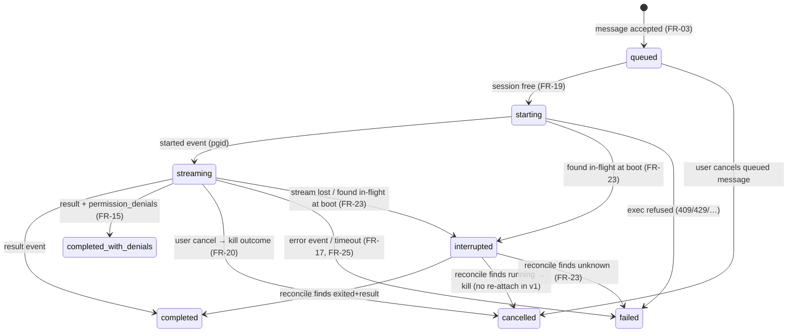
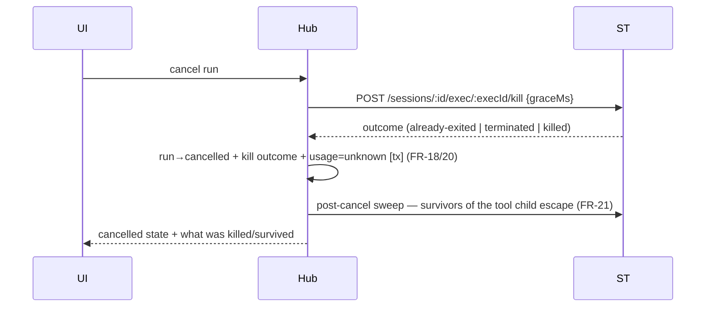

# 05 — Use Cases and Flows (Phase 1)

**Status:** approved (owner, 2026-07-15) · **Last updated:** 2026-07-16

Flows for the Phase-1 MVP, traceable to [04-requirements.md](./04-requirements.md).
Participants: **UI** (frontend) · **Hub** (backend: API, run orchestrator,
`HubStore`/SQLite, `SubstrateExecPort`) · **ST** (shared-terminal backend, via
its public API + the [proposed exec API](./contracts/shared-terminal-exec-api.md)) ·
**CLI** (Claude Code headless inside the session container).

> The original long-form brief enumerated "15 critical flows"; that document
> has not been supplied. The set below is derived from the MVP scope (03 §2)
> and the spike evidence; if the brief surfaces, its list is reconciled here.

## Run state machine

Every run moves through this machine; persistence is transactional per
transition (NFR-01), so a crash can only leave a run in a state the
reconciler (UC-06) knows how to finish.



### Reserved state: `awaiting_approval` (Phase 2+, not in the MVP)

For autonomy levels ≥ 2 (UX-07), Phase 2+ inserts `awaiting_approval` between
`streaming` and its terminal states (entered on an approval-requiring tool
call; exits: approve → back to `streaming`, deny/timeout → `cancelled`). The
name and insertion point are reserved **now** so mobile approvals extend the
machine instead of redesigning it; the diagram above stays MVP-normative and
deliberately does not show the state — nothing in Phase 1 may implement it.

## UC-01 — Create a project (and its session), then conversations

1. User creates a **project**, picking a default agent and optional
   instructions (FR-40/41, FR-02).
2. Hub provisions the project's substrate session from the agent's template,
   with agentSeed carrying agent settings + project instructions (FR-30).
3. Bootstrap streams; Hub records session id ↔ project binding.
4. The project is usable when the session reports ready; conversations under
   it are created instantly (no per-conversation provisioning — they share
   the workspace, ADR-005); messages sent before readiness queue (FR-04,
   FR-33).

Failure path: bootstrap failure → the **project** shows a provisioning error
with the bootstrap log link; retry recreates the session (FR-33, FR-25).

## UC-02 — Send a message (happy path)

```mermaid
sequenceDiagram
    participant UI
    participant Hub
    participant ST
    participant CLI
    UI->>Hub: POST message
    Hub->>Hub: persist message + run(queued→starting) [tx]
    Hub->>ST: POST /sessions/:id/exec (claude -p --resume …, allowlist, caps)
    ST->>CLI: setsid spawn
    ST-->>Hub: started {execId, pgid, requestId}
    CLI-->>ST: stream-json events (stdout)
    ST-->>Hub: output events (NDJSON)
    Hub->>Hub: ingest idempotently; derive activity (FR-13/14)
    Hub-->>UI: stream deltas + activity
    CLI-->>ST: result event, exit 0
    ST-->>Hub: exit {exitCode}
    Hub->>Hub: run→completed + UsageRecord + RunSummary [tx] (FR-42)
    Hub-->>UI: final answer + cost + summary
```

Covers FR-03/05/10/11/12/13/14/16/17/18/42; NFR-01/06; SEC-06/07; OPS-04.
Ingestion tolerates unknown event types mid-stream — S-01 observed
`rate_limit_event` interleaved in ordinary turns (FR-16). The runner passes
prompts via stdin and never positionally after variadic flags (S-01 harness
lesson).

## UC-03 — Message arrives during an active run

1. Second message is persisted and its run enters `queued` (FR-04).
2. UI shows the queued state distinctly (UX-03).
3. When the active run reaches a terminal state, the queue dispatches in
   order — including after a cancellation (FR-04).
4. The user may cancel a queued message before it starts (state machine).

## UC-04 — Cancel an in-flight run



S-01 evidence baked in: the Bash tool's children escape the process group, so
the sweep is mandatory (they keep *running*; since upstream #387 their
zombies are at least reaped — FR-22's counter was retired with it); no result
event exists, so cost is `unknown` (UX-06). If kill `outcome` and stream
`reason` disagree, the outcome is authoritative (merged contract).

## UC-05 — Run completes with permission denials

1. CLI auto-denies a tool outside the allowlist and still reports `success`
   with `permission_denials` populated (S-01 finding i).
2. Hub marks the run `completed_with_denials` — never plain `completed`
   (FR-15).
3. Activity view lists each denied tool with its input; the chat answer is
   annotated as partial (UX-02/03).
4. No automatic retry, and denials can come from the CLI's own built-in
   policy too — both layers recorded (SEC-03).

## UC-06 — Hub restarts while a run is in flight

`interrupted` is the reconciler's staging state: any run found in
`starting`/`streaming` at boot (or whose stream died) is marked `interrupted`
first, then resolved by exactly one of the three probe branches below.

```mermaid
sequenceDiagram
    participant Hub
    participant ST
    Note over Hub: boot
    Hub->>Hub: runs found in starting/streaming → interrupted (FR-23)
    Hub->>ST: GET /sessions/:id/exec/:execId
    alt exited
        ST-->>Hub: {state: exited, exitCode}
        Hub->>Hub: finalize run from stored events + exit
    else running
        ST-->>Hub: {state: running}
        Hub->>ST: kill (no re-attach in v1) → run→cancelled
    else unknown
        ST-->>Hub: {state: unknown}
        Hub->>Hub: run→failed; note orphan possibility
    end
    Note over Hub: conversation stays usable: next turn --resume (FR-24)
```

The stream has no replay (ADR-001): whatever events were persisted before the
crash are the activity record; conversation continuity is the CLI transcript's
job, not the Hub's. Reconciliation works purely from persisted ids and the
seam's status endpoint — no sticky connections — which is what keeps the
contract replica-agnostic (NFR-05).

## UC-07 — Substrate container recreate

1. Session container is killed/recreated (substrate lifecycle).
2. Claude state survives via `workspace/.st` symlinks — substrate-guaranteed,
   CI-asserted (02 §1).
3. An in-flight run at recreate time follows UC-06's `unknown` path.
4. Next message `--resume`s normally (FR-06/24). No Hub-side migration.

## UC-08 — Seam outage / exec failure

1. `POST exec` fails (substrate down, 409 container-not-running (FR-33), 429 caps).
2. Run → `failed` with the error preserved and shown; message stays in
   history and can be re-sent (FR-25).
3. If the NDJSON stream dies mid-run, UC-06's logic applies immediately
   (`interrupted` → status probe).
4. Wall-clock timeout is the backstop for hangs anywhere in the chain
   (FR-17).

## UC-09 — Manual terminal work alongside the agent

1. User opens the session terminal from the conversation (FR-31, UX-05).
2. While a run is active, the UI shows "agent working" in/near the terminal
   surface (FR-32).
3. Human-vs-agent workspace races are possible by design (the shared project
   workspace is a feature); runs stay serialized per project session (FR-19,
   I-2) so agent-vs-agent races cannot happen — across all of the project's
   conversations.

## UC-10 — Backup and restore (operational)

1. On schedule, the Hub produces a consistent snapshot (`VACUUM INTO` /
   online backup API — never a raw copy of a live WAL db) and uploads it to
   R2 with retention (OPS-01).
2. Freshness monitor alerts if the latest successful snapshot is too old
   (OPS-02).
3. Restore: stop Hub → download snapshot → replace db file → start → boot
   reconciliation (UC-06) heals run states. Exercised once before Phase-1
   exit (OPS-03).
4. Accepted loss window = snapshot cadence (R-16 residual).

## UC-11 — Archive a project, then restore it

The product's "delete" and its inverse. Archive is reversible by design
(FR-40/43); this flow is what makes that true for the person, not just for
the database.

1. The owner archives a project. The Hub stops its substrate session
   (FR-40) and the project leaves the default lists; its conversations are
   archived with it (I-12). Nothing is purged — rows stay (09 §6).
2. The owner opens the archived view (`?archived=true`) and restores the
   project. The Hub **restarts the same session** (FR-43): the workspace is
   a host directory, so it survived the stop, and the CLI transcripts under
   it survive with it.
3. The project returns to `ready` and the next turn `--resume`s exactly
   where it left off (FR-24) — the continuity handle still refers to a
   transcript that exists.
4. **Failure path (FR-44):** if the session no longer exists upstream (it
   was hard-deleted, taking its workspace), restore fails with
   `409 session_gone` and the project **stays archived**. The Hub does not
   provision a fresh session in its place: an empty workspace wearing the
   old project's name would misrepresent lost work and leave every
   `runtimeSessionId` dangling.
5. Restoring a conversation whose project is still archived is rejected
   (`409 project_archived`, I-12) — its session is stopped, so it could not
   take a turn.

## Coverage map

| Flow | Requirements exercised |
| --- | --- |
| UC-01 | FR-01/02/04/25/30/33, FR-40/41 |
| UC-02 | FR-03/05/10–14/16/17/18/42, NFR-01/06, SEC-06/07, OPS-04 |
| UC-03 | FR-04/19, UX-03 |
| UC-04 | FR-18/20/21, UX-04/06 (FR-22 retired) |
| UC-05 | FR-15, SEC-03, UX-02/03 |
| UC-06 | FR-23/24, NFR-05 |
| UC-07 | FR-06/24 |
| UC-08 | FR-17/25, FR-33 |
| UC-09 | FR-19/31/32, UX-05 |
| UC-10 | OPS-01/02/03 |
| UC-11 | FR-40/43/44, I-12, UX-08 |

Not flow-shaped (hence absent above): SEC-01/02/04/05/08/10 (enforcement and
cross-cutting security properties, asserted in code review and tests, not in
a single flow) · SEC-09 (forward constraint) · NFR-02/03/04/08
(design/test-time properties) · NFR-07 (deferred to the doc-07/11 transport
decision) · OPS-05/06 (continuous monitoring) · UX-01 (cross-cutting
presentation rule; FR-03 is its flow-side twin in UC-02) · UX-07
(device-target constraint asserted across the API surface, not one flow). Every other ID in
04 appears in the table above. ID gaps between requirement sections (e.g.
FR-07–FR-09) are reserved, unassigned numbers — not missing coverage.
