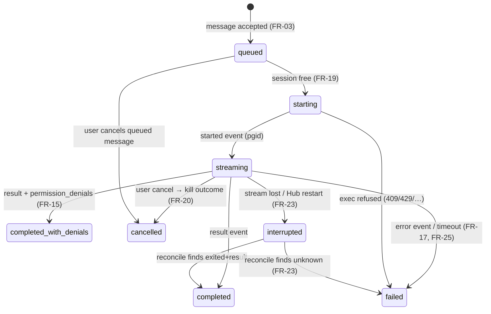
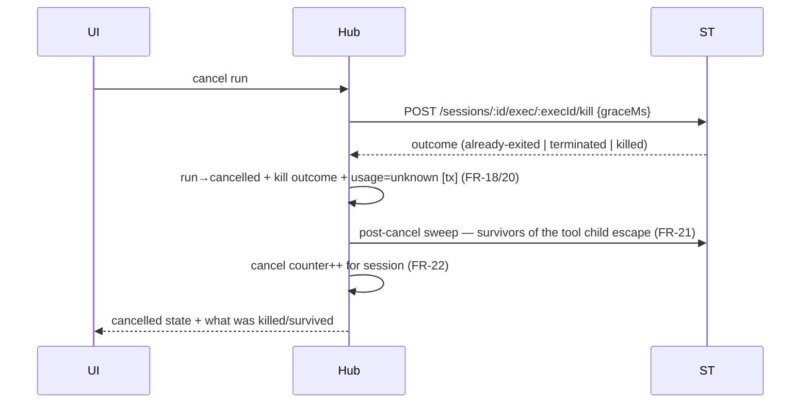

# 05 — Use Cases and Flows (Phase 1)

**Status:** draft — review · **Last updated:** 2026-07-14

Flows for the Phase-1 MVP, traceable to [04-requirements.md](./04-requirements.md).
Participants: **UI** (frontend) · **Hub** (backend: API, run orchestrator,
`HubStore`/SQLite, `SubstrateExecPort`) · **ST** (shared-terminal backend, via
its public API + the [proposed exec API](./contracts/shared-terminal-exec-api.md)) ·
**CLI** (Claude Code headless inside the session container).

> The original long-form brief enumerated "15 critical flows"; that document
> has not been supplied. The set below is derived from the MVP scope (03 §2)
> and the spike evidence; if the brief surfaces, its list is reconciled here.

## Run state machine

Every run moves through this machine; persistence is transactional per
transition (NFR-01), so a crash can only leave a run in a state the
reconciler (UC-06) knows how to finish.



## UC-01 — Create a conversation (and its session)

1. User creates a conversation and picks an agent (from config, FR-02).
2. Hub creates a substrate session from the agent's template
   (`POST /templates`-derived `POST /sessions`), with agentSeed carrying the
   agent's settings/CLAUDE.md (FR-30).
3. Bootstrap streams; Hub records session id ↔ conversation binding.
4. Conversation is usable when the session reports ready; earlier messages
   queue (FR-04, FR-33).

Failure path: bootstrap failure → conversation shows a provisioning error
with the bootstrap log link; retry recreates the session (FR-33, FR-25).

## UC-02 — Send a message (happy path)

```mermaid
sequenceDiagram
    participant UI
    participant Hub
    participant ST
    participant CLI
    UI->>Hub: POST message
    Hub->>Hub: persist message + run(queued→starting) [tx]
    Hub->>ST: POST /sessions/:id/exec (claude -p --resume …, allowlist, caps)
    ST->>CLI: setsid spawn
    ST-->>Hub: started {execId, pgid, requestId}
    CLI-->>ST: stream-json events (stdout)
    ST-->>Hub: output events (NDJSON)
    Hub->>Hub: ingest idempotently; derive activity (FR-13/14)
    Hub-->>UI: stream deltas + activity
    CLI-->>ST: result event, exit 0
    ST-->>Hub: exit {exitCode}
    Hub->>Hub: run→completed + UsageRecord [tx]
    Hub-->>UI: final answer + cost
```

Covers FR-03/05/10/11/12/13/14/17/18; NFR-01/06; SEC-06/07; OPS-04.
The runner passes prompts via stdin and never positionally after variadic
flags (S-01 harness lesson).

## UC-03 — Message arrives during an active run

1. Second message is persisted and its run enters `queued` (FR-04).
2. UI shows the queued state distinctly (UX-03).
3. When the active run reaches a terminal state, the queue dispatches in
   order — including after a cancellation (FR-04).
4. The user may cancel a queued message before it starts (state machine).

## UC-04 — Cancel an in-flight run



S-01 evidence baked in: the Bash tool's children escape the process group, so
the sweep is mandatory; each kill leaves one zombie (counter, FR-22); no
result event exists, so cost is `unknown` (UX-06).

## UC-05 — Run completes with permission denials

1. CLI auto-denies a tool outside the allowlist and still reports `success`
   with `permission_denials` populated (S-01 finding i).
2. Hub marks the run `completed_with_denials` — never plain `completed`
   (FR-15).
3. Activity view lists each denied tool with its input; the chat answer is
   annotated as partial (UX-02/03).
4. No automatic retry, and denials can come from the CLI's own built-in
   policy too — both layers recorded (SEC-03).

## UC-06 — Hub restarts while a run is in flight

```mermaid
sequenceDiagram
    participant Hub
    participant ST
    Note over Hub: boot
    Hub->>Hub: find runs in starting/streaming (FR-23)
    Hub->>ST: GET /sessions/:id/exec/:execId
    alt exited
        ST-->>Hub: {state: exited, exitCode}
        Hub->>Hub: finalize run from stored events + exit
    else running
        ST-->>Hub: {state: running}
        Hub->>ST: kill (no re-attach in v1) → run→cancelled
    else unknown
        ST-->>Hub: {state: unknown}
        Hub->>Hub: run→interrupted→failed; note orphan possibility
    end
    Note over Hub: conversation stays usable: next turn --resume (FR-24)
```

The stream has no replay (ADR-001): whatever events were persisted before the
crash are the activity record; conversation continuity is the CLI transcript's
job, not the Hub's.

## UC-07 — Substrate container recreate

1. Session container is killed/recreated (substrate lifecycle).
2. Claude state survives via `workspace/.st` symlinks — substrate-guaranteed,
   CI-asserted (02 §1).
3. An in-flight run at recreate time follows UC-06's `unknown` path.
4. Next message `--resume`s normally (FR-06/24). No Hub-side migration.

## UC-08 — Seam outage / exec failure

1. `POST exec` fails (substrate down, 409 container-not-running, 429 caps).
2. Run → `failed` with the error preserved and shown; message stays in
   history and can be re-sent (FR-25).
3. If the NDJSON stream dies mid-run, UC-06's logic applies immediately
   (`interrupted` → status probe).
4. Wall-clock timeout is the backstop for hangs anywhere in the chain
   (FR-17).

## UC-09 — Manual terminal work alongside the agent

1. User opens the session terminal from the conversation (FR-31, UX-05).
2. While a run is active, the UI shows "agent working" in/near the terminal
   surface (FR-32).
3. Human-vs-agent workspace races are possible by design (shared workspace is
   a feature); runs stay serialized per session (FR-19) so agent-vs-agent
   races cannot happen.

## UC-10 — Backup and restore (operational)

1. On schedule, the Hub produces a consistent snapshot (`VACUUM INTO` /
   online backup API — never a raw copy of a live WAL db) and uploads it to
   R2 with retention (OPS-01).
2. Freshness monitor alerts if the latest successful snapshot is too old
   (OPS-02).
3. Restore: stop Hub → download snapshot → replace db file → start → boot
   reconciliation (UC-06) heals run states. Exercised once before Phase-1
   exit (OPS-03).
4. Accepted loss window = snapshot cadence (R-16 residual).

## Coverage map

| Flow | Requirements exercised |
| --- | --- |
| UC-01 | FR-01/02/04/30/33, FR-25 |
| UC-02 | FR-03/05/10–14/17/18, NFR-01/06, SEC-06/07, OPS-04 |
| UC-03 | FR-04/19, UX-03 |
| UC-04 | FR-18/20/21/22, UX-06 |
| UC-05 | FR-15/16, SEC-03, UX-02/03 |
| UC-06 | FR-23/24, NFR-05 |
| UC-07 | FR-06/24 |
| UC-08 | FR-17/25, FR-33 |
| UC-09 | FR-19/31/32, UX-05 |
| UC-10 | OPS-01/02/03, R-16 |

Not flow-shaped (hence absent above): SEC-09 (forward constraint), OPS-05/06
(continuous monitoring), NFR-02/03/04/08 (design/test-time properties).
ID gaps between requirement sections (e.g. FR-07–FR-09) are reserved, unassigned
numbers — not missing coverage.
