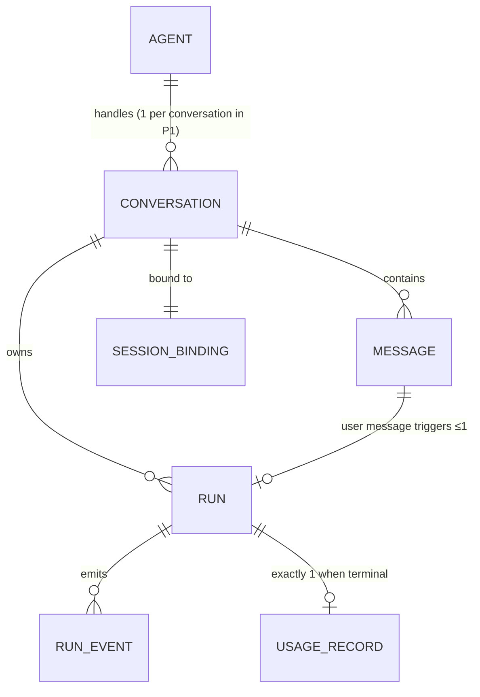

# 06 — Domain Model (Phase 1)

**Status:** draft — review · **Last updated:** 2026-07-14

The entities, relationships, and invariants behind
[04-requirements.md](./04-requirements.md) and the flows in
[05-use-cases-and-flows.md](./05-use-cases-and-flows.md). Storage mapping
(tables, indexes) is doc 09's job; wire contracts are doc 08's. Names here are
canonical for both.

## 1. Overview

Two aggregates, one configuration entity, one value object:

| Element | Kind | Why it exists |
| --- | --- | --- |
| `Agent` | configuration entity (file/env-defined in P1, FR-02) | The logical identity decoupled from runtime (01 §1) |
| `Conversation` | aggregate root (owns `Message`s, `SessionBinding`, runtime continuity state) | The user-facing unit |
| `Run` | aggregate root (owns `RunEvent`s, `UsageRecord`) | The execution unit; heaviest write path |
| `SessionBinding` | value object on `Conversation` | The substrate seam reference |

## 2. Entities

### Agent (config-defined in Phase 1)

| Field | Notes |
| --- | --- |
| `id`, `name` | stable slug; referenced by conversations |
| `instructions` | seeded into the session via agentSeed at provisioning (FR-30) |
| `allowedTools` | the curated allowlist — **mandatory, never empty-meaning-all** (FR-11, SEC-02) |
| `sessionTemplateId` | substrate template the agent's sessions are created from |
| `runtime` | `claude-cli` (only value in P1); the discriminator for the `RuntimeAdapter` |
| `defaultCaps` | `{maxTurns, budgetUsd, timeoutMs}` — every run gets a caps snapshot (FR-17) |

Phase-2 forward constraint: this shape must survive becoming a stored,
user-editable entity (Agent Registry) without field renames.

### Conversation

| Field | Notes |
| --- | --- |
| `id`, `title`, `status` | status: `provisioning \| ready \| error \| archived` (UC-01) |
| `agentId` | immutable in Phase 1 (agent switching is Phase-2 scope) |
| `sessionBinding` | see below |
| `runtimeSessionId` | the CLI's own session id used for `--resume`; updated from each result event (S-01: stable across resumes, but drift is captured, FR-24) |
| `cancelCount` | zombie-budget guard counter, monotonic per session lifetime (FR-22) |

### SessionBinding (value object)

`{sessionId, templateId, lastKnownState}` — everything the Hub knows about
its substrate session. The substrate remains the authority on session state;
`lastKnownState` is a cache for UX (FR-33), never a basis for decisions the
seam can answer live.

### Message

| Field | Notes |
| --- | --- |
| `id`, `conversationId`, `role` | role: `user \| assistant` |
| `content` | assistant content is assembled from the run's stream; user content is verbatim |
| `runId?` | user messages: the run they triggered (FR-03); assistant messages: the run that produced them |
| `createdAt` | — |

### Run

| Field | Notes |
| --- | --- |
| `id`, `conversationId`, `messageId` | the triggering user message |
| `state` | exactly the 05 state machine: `queued \| starting \| streaming \| completed \| completed_with_denials \| cancelled \| interrupted \| failed` |
| `execId?`, `pgid?` | seam handles (ADR-001), set by the `started` event — both absent while `queued`; `pgid` informational |
| `capsSnapshot`, `policySnapshot` | the caps and allowlist the run actually ran with — snapshots, not references, so later agent edits never rewrite history (SEC-08) |
| `cliVersion`, `model` | recorded from the init event (FR-12, R-02) |
| `killOutcome?` | `already-exited \| terminated \| killed` when cancelled (FR-20) |
| `sweepResult?` | post-cancel survivor sweep outcome (FR-21) |
| `error?` | terminal error detail for `failed` (FR-25) |
| `createdAt`, `startedAt?`, `endedAt?` | `startedAt` absent while `queued`; `endedAt` absent until terminal |

### RunEvent

| Field | Notes |
| --- | --- |
| `id` | **idempotency key** — re-ingesting the same event is a no-op (FR-13) |
| `runId`, `seq` | `(runId, seq)` unique, ordering key |
| `type` | `started \| output \| tool_use \| permission_denial \| exit \| error \| unknown` — `unknown` preserves unrecognized stream types verbatim (FR-16) |
| `payload` | capped (NFR-02); oversized content truncated with a marker |
| `ts` | — |

**Activity is a projection, not an entity**: commands and files touched are
derived on read from `tool_use` events (`input.command`, `input.file_path`) —
per A2 and the anti-over-architecture rule, nothing is double-written.
`permission_denial` events are first-class in the projection (FR-15).

### UsageRecord

| Field | Notes |
| --- | --- |
| `runId` | 1:1 with terminal runs |
| `totalCostUsd?`, `numTurns?`, `usage?` | from the result event; **all null when `source = cancelled-unknown`** (FR-18) |
| `source` | `result-event \| cancelled-unknown \| error-partial` |

## 3. Invariants

| # | Invariant | Enforced by |
| --- | --- | --- |
| I-1 | One user message triggers at most one run; every run has exactly one triggering message | FR-03; unique index on `Run.messageId` |
| I-2 | At most one run per conversation is in a non-terminal state; queued runs dispatch FIFO | FR-04/19; transactional dispatch (NFR-01) |
| I-3 | Run state changes follow the 05 state machine only, each transition one transaction | UC-06 preamble |
| I-4 | `RunEvent` ingestion is idempotent (`id`) and ordered (`runId, seq`) | FR-13 |
| I-5 | Every terminal run has exactly one `UsageRecord`, even if its values are unknown | FR-18 |
| I-6 | `Conversation.agentId` never changes in Phase 1 | FR-02 boundary |
| I-7 | `policySnapshot` is non-empty on every run — a run without an explicit allowlist must be unrepresentable | FR-11, SEC-01/02 |
| I-8 | Snapshots (`capsSnapshot`, `policySnapshot`, `cliVersion`) are immutable once the run leaves `queued` | SEC-08 audit trail |
| I-9 | `cancelCount` only increments; crossing the threshold flags the conversation, never blocks it silently | FR-22 |

## 4. Ports (domain boundaries)

| Port | Responsibility | Implementations (P1) |
| --- | --- | --- |
| `HubStore` | All persistence; transactions live here | SQLite (real), in-memory (tests) — ADR-002, NFR-03 |
| `SubstrateExecPort` | exec/status/kill + session lifecycle against the seam | HTTP (per ADR-001 contract, gated on upstream #381), **fake with S-01 fixtures** (A1, NFR-04) |
| `RuntimeAdapter` | Turn semantics for a runtime: build the command (flags, stdin prompt), parse its event stream into `RunEvent`s, map cancellation | `claude-cli` (S-01 lessons encoded), fake (deterministic fixtures) |

`RuntimeAdapter` is deliberately reviewed against a hypothetical HTTP runtime
before freeze (R-12): nothing in its interface may assume stream-json, a CLI,
or a session — those are `claude-cli` implementation details.

## 5. Deliberately not modeled (Phase 1)

User/tenant (single-user, Q-07) · agent registry persistence (Phase 2 — the
`Agent` shape is the forward contract) · router/multi-agent constructs
(Phases 3–4) · memory beyond `runtimeSessionId` continuity (Phase 6) ·
cross-run budgets (Phase 3; per-run caps only, R-06).
