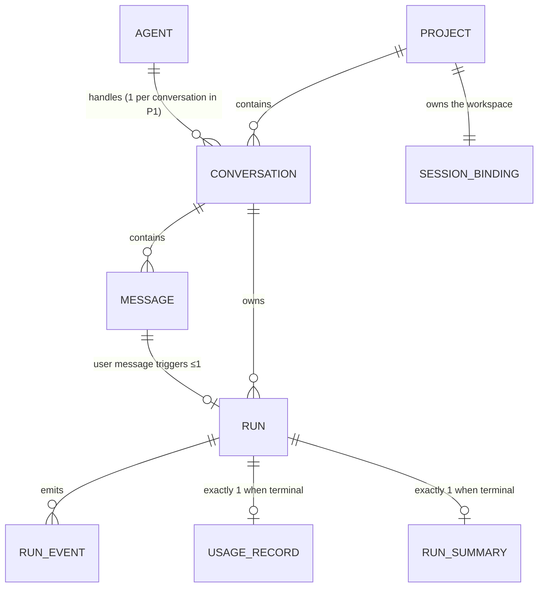

# 06 — Domain Model (Phase 1)

**Status:** approved (owner, 2026-07-15; correction amendments per ADR-007..010, owner 2026-07-17) · **Last updated:** 2026-07-17

The entities, relationships, and invariants behind
[04-requirements.md](./04-requirements.md) and the flows in
[05-use-cases-and-flows.md](./05-use-cases-and-flows.md). Storage mapping
(tables, indexes) is doc 09's job; wire contracts are doc 08's. Names here are
canonical for both.

## 1. Overview

Two aggregates, one configuration entity, one value object:

| Element | Kind | Why it exists |
| --- | --- | --- |
| `Project` | aggregate root (owns `SessionBinding` and its `Conversation`s) | The organizing unit — matches how the owner works ([ADR-005](./adr/ADR-005-project-aggregate.md)); one workspace/container per project |
| `Agent` | configuration entity (file/env-defined in P1, FR-02) | A **professional role** (architect, QA, security reviewer…) decoupled from the runtime that executes it (01 §1); the runtime is an execution detail |
| `Conversation` | entity under `Project` (owns `Message`s, runtime continuity state) | The dialogue unit; inherits the project's workspace |
| `Run` | aggregate root (owns `RunEvent`s, `UsageRecord`, `RunSummary`) | The execution unit; heaviest write path |
| `SessionBinding` | value object on `Project` | The substrate seam reference |

**Terminology — "session" names three different things; this table is
normative:**

| Term | What it is | Who holds it |
| --- | --- | --- |
| **Substrate session** | The persistent shared-terminal environment: container, workspace, repository — **owned by the owner's admin account, visible and manually usable there** (ADR-007; the Hub's account is only an execution identity) | The **Project**, via `SessionBinding` — never a conversation, task, or run (ADR-005 rejected session-per-conversation) |
| **Runtime session** | A runtime's continuity/transcript handle — e.g. the Claude CLI's `runtimeSessionId` used for `--resume`. Many coexist in one substrate session (S-01) | `Conversation` in Phase 1; later phases may attach continuity to a Task, Run, or Step instead |
| **Agent role** | Reusable specialty configuration: instructions, tools, criteria, permissions | Config (`Agent`, becoming **Specialist** — ADR-008); owns no *project* workspace ever, but may have an **optional personal session** for general/non-project work (ADR-008 carve-out to the original "no session of its own"); no cross-project memory ([18 §2](./18-agent-collaboration-model.md)) |

## 2. Entities

### Agent (config-defined in Phase 1)

| Field | Notes |
| --- | --- |
| `id`, `name` | stable slug; referenced by conversations |
| `instructions` | the role's craft. Travels **per turn** via `--append-system-prompt`, as tools do, and is snapshotted onto the run at send like caps and policy (B5-04, I-8; mechanism verified against the pinned CLI in [S-04](./spikes/S-04/RESULTS.md)). It is NOT seeded into the workspace at provisioning: the workspace is the project's and several roles share it (ADR-006), so a baked `CLAUDE.md` ran every conversation under the provisioning agent's craft. Contrast `Project.instructions`, which stays in the workspace precisely because every role in the project shares it |
| `allowedTools` | the curated allowlist — **mandatory, never empty-meaning-all** (FR-11, SEC-02) |
| `runtime` | `claude-cli` (only value in P1); the discriminator for the `RuntimeAdapter` |
| `defaultCaps` | `{maxTurns, budgetUsd, timeoutMs}` — every run gets a caps snapshot (FR-17) |
| `role?` | professional label, e.g. "Software Developer" (ADR-008, N3a); optional — pre-N3 configs omit it |
| `capabilities?` | free-form tags the router (N4) selects on (ADR-008); optional list |

Phase-2 forward constraint: this shape must survive becoming a stored,
user-editable entity (Agent Registry) without field renames — and it stays a
**stateless role template**: accumulated knowledge (memory, decisions,
history) binds to the *(project, agent)* pair, never to the agent alone
([18 §2](./18-agent-collaboration-model.md), knowledge-isolation rule).

Correction (ADR-008, N3): `Agent` becomes **Specialist** — same stateless
template extended with `role` and `capabilities` (N3a) — and gains an optional
**`SpecialistSessionBinding`** (N3b-1): `{specialistId, sessionId,
ownerAccountId, ownership, bindingMode, lastKnownState, status:
available|busy|offline|error}`, a standing personal session in the owner's
account for general/non-project work. Bound or created exactly like a
project's (ADR-007) — one per specialist, back-linked
`external_ref = agenthub:specialist:<id>`; `busy` awaits N3b-2. The identity
and the session are distinct things; project work usually executes in the
project's primary session or a task worktree (ADR-010), and repo
access/credentials never attach to the specialist (ADR-006 unchanged).

### Project

| Field | Notes |
| --- | --- |
| `id`, `name`, `status` | status: `provisioning \| ready \| error \| archived` — session provisioning lives here (UC-01) |
| `sessionBinding` | see below — one workspace/container per project (ADR-005) |
| `sessionTemplateId` | the substrate template this project's session is created from — **the project's, not the agent's** (ADR-006, FR-45) |
| `repo?` | `{url, ref?, target?}` — the repository cloned into the workspace. **The credential is not a field of this type.** `auth` travels to the seam as its own value (`repoAuth`), never attached to the stored object: keeping the storable half and the secret half as separate values is what makes it impossible for a code path to pass them around together and write them together. That type-level separation IS the SEC-11 mitigation — a `repo.auth` field would defeat it, however carefully the writer avoided persisting it (FR-47, SEC-11) |
| `defaultAgentId` | seeds new conversations; overridable per conversation |
| `instructions?` | project-level context seeded into the session (agentSeed) |

Deferred to Phase 2+ (ADR-005, guarded by R-17): project memory, document
library, multiple repos/workspaces, multiple terminals, per-project
permission overrides.

### Conversation

| Field | Notes |
| --- | --- |
| `id`, `title`, `status` | status: `active \| archived` — provisioning belongs to the project |
| `projectId` | the project, or **`null`** for a direct conversation with a specialist (N3b-2) — which runs in the specialist's personal session, not a project's. Immutable once set (I-10) |
| `mode` | `direct \| preferred-specialist \| automatic` (N3b-2, ADR-008). `direct` is the only mode built — a pinned specialist (or a project's agent). `automatic`/`preferred-specialist` arrive with the N4 router |
| `agentId` | the agent (project) or specialist (direct); immutable in `direct` mode (the built behavior). In `automatic` mode (N4) no immutable agentId exists and the acting specialist is recorded per run/step (ADR-008, FR-51) |
| `runtimeSessionId` | the CLI's own session id used for `--resume`; updated from each result event (S-01: stable across resumes, but drift is captured, FR-24). Many CLI sessions coexist in one workspace — directly verified by S-01's published run (five distinct sessions in one container, one resumed by id while the others coexisted; see the [S-01 fixtures](./spikes/S-01/fixtures/run-20260714T142930Z/)) — which is what lets conversations share the project's container |

### SessionBinding (value object on Project)

`{sessionId, templateId, lastKnownState}` — everything the Hub knows about
the project's substrate session. The substrate remains the authority on
session state; `lastKnownState` is a cache for UX (FR-33), never a basis for
decisions the seam can answer live.

Correction (ADR-007, lands in N2 as `ProjectSessionBinding`): gains
`ownerAccountId` and `bindingMode: existing | created` — the session belongs
to the owner's admin account, whether the Hub attached to one the owner
already had or created one there (shared-terminal#420). Pre-correction rows
migrate as `legacy-technical` (migration 004) and keep working
until deliberately rebound.

### Message

| Field | Notes |
| --- | --- |
| `id`, `conversationId`, `role` | role: `user \| assistant` |
| `content` | assistant content is assembled from the run's stream; user content is verbatim |
| `runId?` | user messages: the run they triggered (FR-03); assistant messages: the run that produced them |
| `createdAt` | — |

### Run

| Field | Notes |
| --- | --- |
| `id`, `conversationId`, `messageId` | the triggering user message |
| `state` | exactly the 05 state machine: `queued \| starting \| streaming \| completed \| completed_with_denials \| cancelled \| interrupted \| failed` |
| `execId?`, `pgid?` | seam handles (ADR-001), set by the `started` event — absent through `queued` and `starting`; `pgid` informational |
| `capsSnapshot`, `policySnapshot` | the caps and allowlist the run actually ran with — snapshots, not references, so later agent edits never rewrite history (SEC-08) |
| `cliVersion`, `model` | recorded from the init event (FR-12, R-02) |
| `killOutcome?` | `already-exited \| terminated \| killed` when cancelled (FR-20) |
| `sweepResult?` | post-cancel survivor sweep outcome (FR-21) |
| `error?` | terminal error detail for `failed` (FR-25) |
| `createdAt`, `startedAt?`, `endedAt?` | `startedAt` set by the `started` event (absent through `queued`/`starting`); `endedAt` absent until terminal |

### RunEvent

| Field | Notes |
| --- | --- |
| `id` | **idempotency key** — re-ingesting the same event is a no-op (FR-13) |
| `runId`, `seq` | `(runId, seq)` unique, ordering key |
| `type` | `started \| output \| tool_use \| permission_denial \| exit \| error \| unknown` — `unknown` preserves unrecognized stream types verbatim (FR-16) |
| `payload` | capped (NFR-02); oversized content truncated with a marker |
| `ts` | — |

**Activity is a projection, not an entity**: commands and files touched are
derived on read from `tool_use` events (`input.command`, `input.file_path`) —
per A2 and the anti-over-architecture rule, nothing is double-written.
`permission_denial` events are first-class in the projection (FR-15).

### UsageRecord

| Field | Notes |
| --- | --- |
| `runId` | 1:1 with terminal runs |
| `totalCostUsd?`, `numTurns?`, `usage?` | from the result event; **all null when `source = cancelled-unknown`** (FR-18) |
| `source` | `result-event \| cancelled-unknown \| error-partial` |

### RunSummary (persisted projection)

Written in the same transaction as the terminal state transition, 1:1 with
terminal runs (I-11). **Mechanically derived — never model-generated** (zero
token cost, deterministic, available even for cancelled runs): objective
(user-message excerpt), outcome state, files touched and commands run (from
the activity projection), denial count, warnings (capped stderr excerpt),
cost/turns (from `UsageRecord`, `unknown` where it is), duration, and the
`runtimeSessionId` continuation handle. This is the first **Work Product**
(01 §4) — the Phase-4 generic artifact system grows from this seed. Narrative
model-authored fields are a later enrichment, not Phase 1.

## 3. Invariants

| # | Invariant | Enforced by |
| --- | --- | --- |
| I-1 | One user message triggers at most one run; every run has exactly one triggering message | FR-03; unique index on `Run.messageId` |
| I-2 | At most one run per **workspace** (substrate session) is in a non-terminal state; queued runs dispatch FIFO per workspace. The workspace key is the project id for a project conversation, or `specialist:<agentId>` for a direct specialist conversation (N3b-2) — "the lock follows the workspace" (18 §2, realized in N3b-2) | FR-04/19; transactional dispatch (NFR-01) |
| I-3 | Run state changes follow the 05 state machine only, each transition one transaction | UC-06 preamble |
| I-4 | `RunEvent` ingestion is idempotent (`id`) and ordered (`runId, seq`) | FR-13 |
| I-5 | Every terminal run has exactly one `UsageRecord`, even if its values are unknown | FR-18 |
| I-6 | `Conversation.agentId` never changes **in `direct` mode** (the only mode built so far, where it is required). In `automatic` mode (FR-51, N4) no immutable agentId exists — which specialist ran lives on each run/task step | FR-02 boundary, ADR-008 |
| I-7 | `policySnapshot` is non-empty on every run — a run without an explicit allowlist must be unrepresentable | FR-11, SEC-01/02 |
| I-8 | `capsSnapshot`/`policySnapshot` are immutable once the run leaves `queued`; `cliVersion`/`model` are **write-once** when the init event records them and immutable after | SEC-08 audit trail |
| — | (I-9 is a retired draft-era number — assigned to the FR-22 cancel counter and withdrawn with it before merge; invariant IDs, like requirement IDs, are never reused) | — |
| I-10 | `Conversation.projectId` never changes **once set**; it is nullable for direct specialist conversations (owner decision 2026-07-17, ADR-008 — migration 006, N3b-2) | ADR-005, ADR-008 |
| I-11 | Every terminal run has exactly one `RunSummary`, written in the terminal transition's transaction | FR-42 |
| I-12 | An active conversation never belongs to an archived project — archiving a project stops the session its conversations share (FR-40), so an active conversation there could not take a turn. Archiving a project archives its conversations with it; restoring a conversation requires its project to be restored first | FR-43 |

## 4. Ports (domain boundaries)

| Port | Responsibility | Implementations (P1) |
| --- | --- | --- |
| `HubStore` | All persistence; transactions live here | SQLite (real), in-memory (tests) — ADR-002, NFR-03 |
| `SubstrateExecPort` | exec/status/kill + session lifecycle against the seam | HTTP (per ADR-001 contract, gated on upstream #381), **fake with S-01 fixtures** (A1, NFR-04) |
| `RuntimeAdapter` | Turn semantics for a runtime: build the command (flags, stdin prompt), parse its event stream into `RunEvent`s, map cancellation | `claude-cli` (S-01 lessons encoded), fake (deterministic fixtures) |

`RuntimeAdapter` is deliberately reviewed against a hypothetical HTTP runtime
before freeze (R-12): nothing in its interface may assume stream-json, a CLI,
or a session — those are `claude-cli` implementation details.

## 5. Deliberately not modeled (Phase 1)

User/tenant (single-user, Q-07) · agent registry persistence (the
`Specialist` shape is the forward contract) · project memory/documents
(Phase 2+, ADR-005) · memory beyond `runtimeSessionId` continuity (Phase 6)
· cross-run budgets (per-run caps only, R-06) · a **generic** workflow
engine and **generic** `WorkProduct` entity (still deferred, 18 §6).

Pulled forward by the correction (no longer "not modeled", each lands with
its increment, doc 19): `Task`/`TaskStep` + the dev → QA → human-approval
machine (ADR-009, N5–N6); the router and the deterministic execution-target
selector (ADR-008, N4); `ImplementationReport`/`QaReport` as the first Work
Products beyond `RunSummary` (ADR-009); `SpecialistSessionBinding` and
`ExecutionTargetDecision` (ADR-008, N3–N4).
