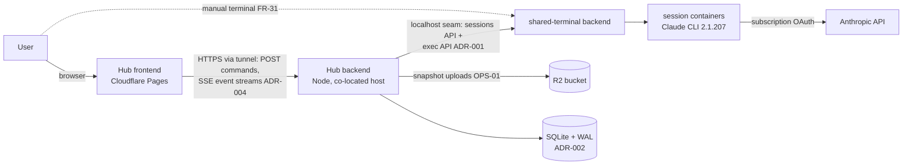
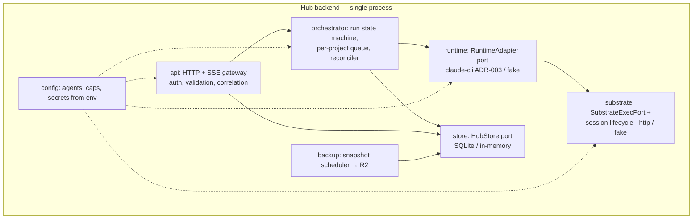

# 07 — Architecture (Phase 1)

**Status:** approved (owner, 2026-07-15) · **Last updated:** 2026-07-15

How the Phase-1 system is put together: context, modules, runtime behavior,
deployment, and the decisions that bind them. Domain names from
[06-domain-model.md](./06-domain-model.md); requirements from
[04-requirements.md](./04-requirements.md); decision records in
[adr/](./adr/README.md).

## 1. System context

Trust boundaries: the browser is untrusted input (SEC-01); session containers
are semi-trusted execution sandboxes with open egress (R-05 — the container
boundary is not an exfiltration boundary); the seam is localhost-only and
authenticated as the Hub's dedicated substrate account (SEC-06).

## 2. Modules (one Node process, modular monolith)

Module rules:

- Dependencies point inward to `store`/domain types; `api` never touches
  `substrate` directly; `runtime` is the only module that understands
  stream-json (ADR-003); `substrate` is the only one that knows HTTP seam
  details. Ports and fakes per 06 §4.
- No cross-module imports around the arrows above — enforced by lint
  (`eslint-plugin-boundaries` or equivalent) once code exists, so the
  monolith stays modular by tooling, not discipline.

## 3. Runtime behavior

- **Turn**: exactly UC-02; the orchestrator owns the state machine and
  performs every transition in one `HubStore` transaction (NFR-01, I-3).
- **Queueing**: an in-process FIFO per project (I-2). No broker — the
  queue's durable form IS the `queued` runs in SQLite; the in-memory
  structure is rebuilt from it at boot (R-10, R-13).
- **Reconciler**: runs at boot before the API accepts writes (UC-06);
  also re-arms the queue.
- **Backup**: interval timer → `VACUUM INTO` temp file → upload to R2 →
  freshness gauge (OPS-01..03); failures alert, never crash the process.
- **Correlation**: one Hub-generated id per inbound request, propagated to
  logs and joined with the seam's `X-Request-Id` per exec on the run row
  (OPS-04).

## 4. Deployment

Mirrors the substrate (ADR-002 context): systemd-or-compose managed Node
process on the same host, SQLite file on local disk (outside
`WORKSPACE_ROOT`, OPS-05), frontend static on Pages, exposure through the
existing Cloudflare tunnel under a Hub hostname (identifier stays out of this
repo, R-09). Before creating sessions the Hub checks its account's headroom
via the substrate's `GET /quotas` (02 §6). Single replica by design; every
contract stays replica-agnostic (NFR-05).

## 5. Decisions bound in this document

| Decision | Where | Status |
| --- | --- | --- |
| Runner integration: per-turn CLI invocation, stdin prompts, event mapping, marker-based post-cancel sweep, lagging-budget enforcement | [ADR-003](./adr/ADR-003-claude-cli-runner.md) | proposed |
| UI streaming: SSE with `Last-Event-ID` replay from the store | [ADR-004](./adr/ADR-004-ui-streaming-transport.md) | proposed |
| **Stack: TypeScript/Node — Q-09 challenge window closes here.** The seam, the CLI, and the substrate are all Node; stream parsing and SSE are native strengths; a solo maintainer gains compounding returns from one ecosystem. No challenger produced a failing constraint | this doc; 15 Q-09 | resolved with this doc's approval |
| Hub auth model (Q-07): Phase 1 ships single-user behind a single credential at the API gateway; the boundary is one middleware so a real model can replace it without touching modules | deferred ADR — written when multi-user pressure is real | open (non-blocking) |

## 6. Cross-cutting

- **Errors**: every failure surfaces as a typed run/conversation error
  (FR-25); the taxonomy lives in doc 08 next to the contracts.
- **Secrets**: env-only (SEC-04); the OAuth token transits to sessions only
  as exec env per ADR-003; nothing secret is ever persisted or logged
  (SEC-05).
- **Time**: all timestamps UTC ISO-8601; budget/timeout arithmetic uses
  monotonic clocks in-process.
- **Observability floor** (full treatment in doc 14): structured logs with
  correlation ids, run-state transition counters, backup freshness gauge,
  seam error-rate counter.

## 7. Explicitly not built (Phase 1)

Message broker / job queue · Durable Objects or Workers backend (ADR-002
context) · WebSockets (ADR-004) · service split of any kind · ORM beyond a
thin query layer · plugin system for runtimes (two adapters, one interface —
the third runtime pays for the abstraction upgrade, R-10/R-12).
