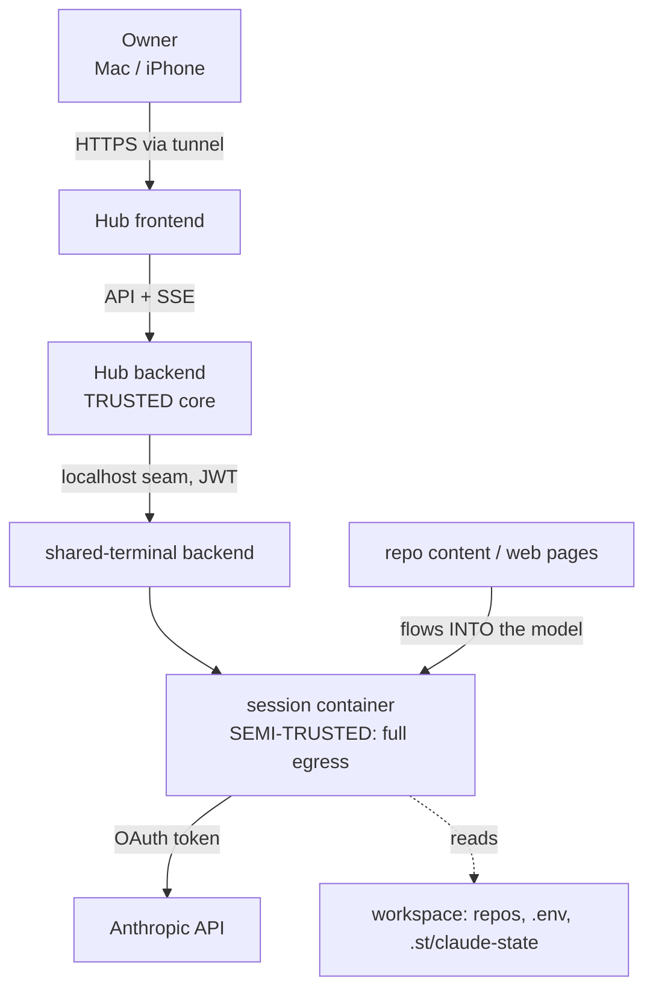

# 10 — Security Threat Model (Phase 1)

**Status:** draft — review · **Last updated:** 2026-07-14

Asset/attacker/vector analysis for the Phase-1 MVP, plus the open-source
hygiene posture for a public repo describing a personal deployment. Extends
the decision-level rows of [16-risk-register.md](./16-risk-register.md) with
attacker detail; every mitigation cites its enforcing requirement
([04](./04-requirements.md)) or ADR. Backend-as-authority (01 §3, SEC-01) is
the spine: models propose, code decides.

## 1. Trust boundaries

- **Trusted:** the Hub backend, its host, its SQLite/R2 data.
- **Semi-trusted:** the session container — it runs model-directed code with
  full network egress. The container boundary is **not** a data-exfiltration
  boundary (R-05); treat everything inside as reachable by a subverted run.
- **Untrusted:** the public origin, and — the defining property of an agent
  system — **any content the model reads** (repo files, web pages, tool
  output) is attacker-controllable input to the model's next action.

## 2. Assets

| Asset | Where | Worst case if lost |
| --- | --- | --- |
| Anthropic OAuth token | Hub env → exec env (SEC-07) | attacker bills/impersonates the account |
| Cloudflare API token (D1 era retired; R2 now) | Hub env | snapshot bucket read/write |
| Substrate JWT (Hub's dedicated account) | Hub memory/config | control of Hub-created sessions (SEC-06) |
| Workspace secrets (`.env`, PATs, deploy keys) | session workspace | lateral movement into the owner's other systems |
| Conversation data + transcripts | Hub SQLite, `.st/claude-state` (plaintext on host) | disclosure of everything discussed/done |
| The deployment's shape | host, tunnel, hostnames | targeting information (R-09) |

## 3. Attackers

| A | Attacker | Capability |
| --- | --- | --- |
| A1 | **Prompt-injection content** (repo/web/tool output a run ingests) | steer an unattended run's tool use — the primary threat (R-05) |
| A2 | Unauthenticated network attacker on the public origin | reach the Hub API / frontend |
| A3 | Compromised frontend JS / owner's browser | act as the owner |
| A4 | Curious/passive party reading the public repo | learn deployment details, harvest committed secrets (R-09) |
| A5 | Substrate-side compromise (out of Hub scope, inherited) | plaintext state on host (02 §4.1) |

Explicitly **out of scope** for Phase 1 (single-user, Q-07): a malicious
authenticated user — there is only the owner. Multi-user threats arrive with
the auth model.

## 4. Vectors and mitigations

### V-1 — Prompt injection → tool misuse (A1) · **primary**

A run reads hostile content (a README, a fetched page, a tool result) that
instructs it to exfiltrate `.env`, corrupt the repo, or spend budget. Nobody
is watching (unattended, unlike interactive Claude).

- Curated allowlist (SEC-02, 08 §5): no web tools while egress is open —
  `curl`-from-Bash at least lands in the audit trail; `WebFetch` normalizes
  exfiltration. Backend-enforced, `--dangerously-skip-permissions` forbidden.
- Per-run caps (FR-17) bound blast radius: turns, budget, wall-clock.
- Every command/file/denial in the audit trail (SEC-08) — post-hoc
  detection.
- Autonomy levels + approvals (Phase 2+, `awaiting_approval` reserved)
  eventually gate irreversible actions.
- **Residual (accepted, documented):** with egress open and secrets possibly
  in the workspace, a determined injection can still exfiltrate via an
  allowed tool. The mitigation is *narrowing what runs can touch*, not a hard
  boundary — stated plainly so it is never mistaken for solved. Real
  containment (egress policy, secret-free workspaces) is later-phase.

### V-2 — Secret leakage into persisted data / logs (A1, A5)

Tool output echoes `.env`; a token lands in a run event, the DB, or a log.

- Secrets live in Hub env only, never in prompts (SEC-04).
- Event payloads classified + known secret values scrubbed before persisting;
  payloads never logged by default (SEC-05).
- The OAuth token reaches sessions only as exec env, never committed to a
  workspace or echoed by seeded config (SEC-07).
- **Residual:** best-effort scrubbing can't catch derived/encoded secrets
  (R-07); transcripts under `.st/claude-state` are plaintext on the host by
  substrate design (A5, 02 §4.1) — inherited, not fixable here.

### V-3 — Public-origin / API attack (A2)

- Single-credential gateway on every `/api` route (08 §1); no unauthenticated
  mutation.
- The seam is localhost-only — not publicly routable (07 §4).
- Inherits the substrate's CSWSH/upgrade defenses for anything WS; the Hub's
  own live channel is SSE over authenticated HTTP (ADR-004), no upgrade path.

### V-4 — Browser/frontend compromise (A3)

Accepted as owner-equivalent in Phase 1: the frontend acts with the owner's
authority by design. Standard hygiene only (no secrets in frontend bundles,
CSP at doc-14 time). Not over-invested for a single-user tool.

### V-5 — Public-repo information leak (A4) · see §5

## 5. Open-source posture (public repo, private deployment)

The design and threat classes are public; the deployment is not.

### Never in the repo

Keys/tokens (Anthropic, Cloudflare, GitHub); real hostnames, tunnel IDs, D1
database IDs, IPs, account/org UUIDs; production session IDs; real
conversation content; **agent/project instructions carrying personal context**
(SEC-10). Enforced by: `.gitignore` from PR-0 (`.env`, `spikes/**/raw/`,
`_inputs/`), GitHub secret scanning + push protection (both repos), the
fixture sanitizer (provider ids + signatures, R-09), and the review bot's
public-hygiene checklist.

### Separate deployment from code (recommendation)

A **private deployment repo/directory** — real `docker-compose`/systemd unit,
hostnames, tunnel config, `agents.<name>.yaml`, `.env` — kept out of the
public repo entirely (the same split already used with shared-terminal). The
public repo ships only `agents.example.yaml` and `.env.example` with
placeholders (SEC-10). This keeps §2's "deployment shape" asset off the
public internet.

### Documentation that stays private

Anything naming the owner's real projects, infrastructure topology, or
security-control specifics of the live deployment. The public threat model
(this doc) describes *classes* of risk in the design — never live
vulnerabilities of the concrete deployment.

### Agent-system-specific repo risks

- Model-generated content committed to public workspaces can leak context or
  reproduce injected payloads — the review bot guards Hub PRs; the same
  discipline applies to any workspace the owner makes public.
- Fixtures capture real tool output and provider ids — the S-01 sanitizer is
  mandatory before any fixture is committed (NFR-08); its hard-fail gates
  (keys, `msg_/req_/toolu_`, thinking signatures) are the backstop.

## 6. Assumptions to validate in implementation

- Secret-scrubbing (SEC-05) catches the token formats actually seen in tool
  output — verify against S-01's corpus before trusting it.
- The single-credential gateway is genuinely in front of *every* mutating
  route (a missed route is V-3's whole risk) — asserted by a route-coverage
  test (doc 13).
- No log statement writes an event payload by default — asserted by a lint
  rule or test, not convention.

## 7. Deferred (later phases, tracked)

Egress policy / network-segmented sessions (real V-1 containment) · autonomy
levels + approval gates (Phase 2+) · multi-user auth threats (Q-07) ·
secret-free workspace injection (removing V-2's premise) · at-rest encryption
of the Hub DB and substrate state. Each is a phase item, not an MVP gap —
recorded so the residuals above are never mistaken for oversights.
