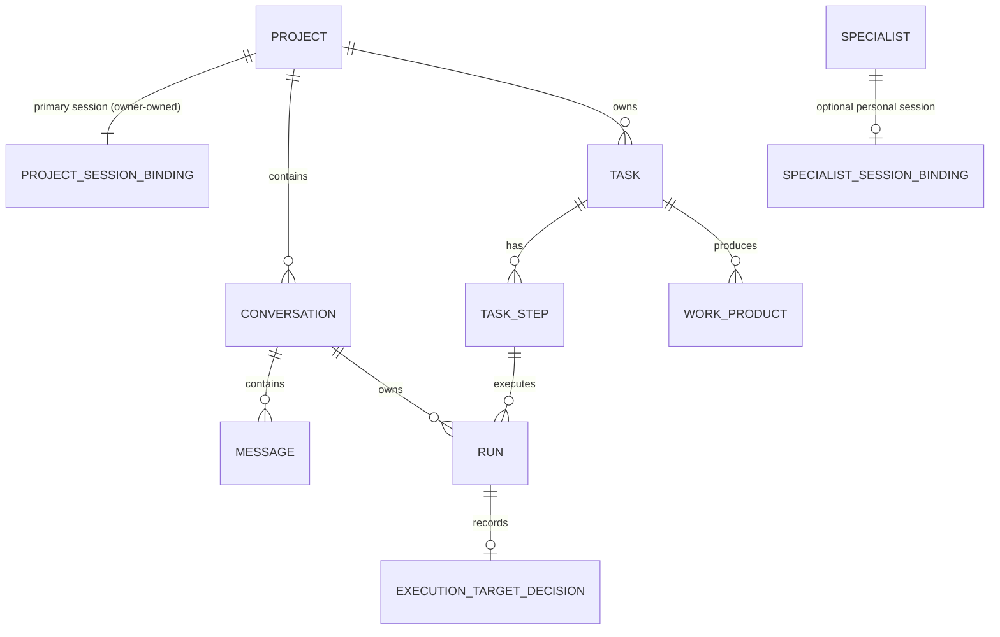
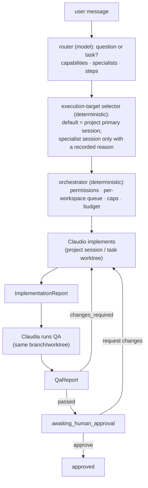

# 19 — Model Correction Plan (2026-07-17)

**Status:** approved (owner, 2026-07-17) · **Last updated:** 2026-07-17

The owner's correction directive (2026-07-17) redefines how projects,
sessions, and specialists relate: **a project corresponds to a real Shared
Terminal session owned by the owner's admin account**; specialists are
reusable identities distinct from their optional personal sessions;
conversations default to automatic routing; coordinated work carries a
dev → QA → human-approval lifecycle. Decisions live in
[ADR-007](./adr/ADR-007-session-ownership-and-binding.md) ·
[ADR-008](./adr/ADR-008-specialists-and-execution-target.md) ·
[ADR-009](./adr/ADR-009-task-lifecycle-dev-qa-approval.md) ·
[ADR-010](./adr/ADR-010-code-sharing-strategies.md). This document is the
diagnosis, migration plan, and increment backlog. Where it conflicts with
doc 03's phase ordering, this plan (owner directive) governs; affected docs
are amended as their increments land (§7).

This is a correction, not a rewrite: chat, messages, streaming, runs,
cancellation, adapters, store, and most of the orchestrator are preserved
(§6).

## 1. Diagnosis — current code vs. corrected model

Two load-bearing contradictions; everything else is additive.

- **C1 — Session lifecycle.** `provision()` always creates a fresh session
  (`backend/src/orchestrator/orchestrator.ts:216`), named `hub-<hex>`
  (`substrate/real.ts:303`), owned by the Hub's dedicated account
  (`substrate/seamAuth.ts:57-78`; SEC-06 pre-amendment mandated it). No
  bind-existing path; `SubstrateExecPort` (`domain/ports.ts:105-125`) has no
  list/metadata/terminal-URL operations; no Hub API route or frontend view
  shows a session.
- **C2 — Fixed specialist.** `Conversation.agentId` required + immutable
  (I-6, `domain/types.ts:118`), resolved once (`orchestrator.ts:349`), read
  for every run (`orchestrator.ts:370`); the execution session is
  hard-derived project → binding (`orchestrator.ts:546-549`).

Additive gaps: no Task entity (`runStateMachine.ts:7` reserves the approval
state), specialists config-only, schema pins the old shapes
(`conversations.agent_id NOT NULL`; no binding-mode/owner columns; no
target-session on runs; no tasks/work_products tables).

Already aligned (kept as-is): agent-as-stateless-role (ADR-006) **is** the
Specialist concept; repo + PAT on the Project, never the agent (FR-45/46/47,
SEC-11); per-turn role instructions (B5-04, S-04) — the mechanism behind
ADR-010's strategy A; workspace as exclusion unit (I-2); doc 18's
router/selector/supervisor decomposition and Work Product envelope.

## 2. Substrate capabilities (verified at `0cd4ed5`) and upstream asks

The previous pin `36be2f2` predates the exec API itself; re-pin is part of
N1. Capability matrix against the directive's eight needs:

| Need | Verdict | Evidence at `0cd4ed5` |
| --- | --- | --- |
| List the owner's sessions | yes | `GET /api/sessions` (own); `GET /api/admin/sessions` (all + owner) `routes/admin.ts:113-158` |
| Read session metadata | yes | `GET /api/sessions/:id` operate-tier since upstream #412 |
| Create in the owner's account | partial | owner = JWT caller, always (`routes/sessions.ts:80,210-217`) → [#420](https://github.com/gatof81/shared-terminal/issues/420) |
| Exec on an owner session (delegated) | **missing** | exec routes owner-only (`routes/exec.ts:88,298,338`) → [#416](https://github.com/gatof81/shared-terminal/issues/416) |
| Terminal URL | **missing** | SPA has no routing → [#419](https://github.com/gatof81/shared-terminal/issues/419) |
| Delegate to a service account | partial | admin flag → WS drive + some REST operate gates, audited; no scoped tokens (future) |
| Attach metadata | **missing** | only `name` ≤64 chars → [#418](https://github.com/gatof81/shared-terminal/issues/418) |
| Detect state/activity | partial | status/`runtimeReady`/usage/`lastConnectedAt` + observe-log; no command history |

Sequencing (owner decision): **upstream first** — #416 → #418 → #419 → #420
land before the Hub increments that need them. N1 needs none of them (#419
improves it); N2's bind-existing needs #416 to *execute*, #420 only for
create-new; N3+ inherit.

Optional/future upstream (deliberately not asked now): scoped service
tokens, per-session exec listing, command-level audit, cross-session
read-only mounts, manual-intervention notifications.

## 3. Target domain model

- `ProjectSessionBinding {sessionId, ownerAccountId,
  bindingMode: existing|created, lastKnownState, templateId?}` (ADR-007).
- `Specialist {id, name, role, instructions, allowedTools, capabilities}` —
  config-defined (SEC-10); `SpecialistSessionBinding {specialistId,
  sessionId, ownerAccountId, ownership, bindingMode, lastKnownState, status}`
  (ADR-008, refined N3b-1 — `capabilities` removed, see ADR-008 Consequences).
- `Conversation.mode: automatic | preferred-specialist | direct`;
  `projectId` nullable (specialist general conversations, owner decision);
  `agentId` immutable only in direct mode.
- `Task` + `TaskState` per ADR-009; `ImplementationReport`/`QaReport` extend
  the Work Product envelope (18 §4).
- `ExecutionTargetDecision {specialistId, selectedSessionId, reason,
  alternativesConsidered, workspaceStrategy}` on the run (ADR-008/010).

## 4. Target automatic flow

The chat surfaces a readable summary (who did what, what passed, what awaits
approval) with links to reports/diff/terminal; raw events stay in the
inspector (ADR-009).

## 5. Store migration plan (forward-only; no data loss)

| # | Migration | Contents |
| --- | --- | --- |
| 004 | project session binding | `projects` += `binding_mode` (backfill `created`), `owner_account_id` (NULL = legacy), `ownership` (backfill `legacy-technical` — ADR-007: rebound deliberately, never reassigned silently) |
| 005 | specialist sessions (N3b-1, **landed first**) | new `specialist_sessions` (specialist identities stay in config); the `busy` status awaits N3b-2 |
| 006 | conversation mode (N3b-2) | `conversations` += `mode` (backfill `direct`); `agent_id` nullable (NULL legal only outside direct mode); `project_id` nullable (I-10 becomes "never changes once set"). The 005/006 order swapped from the original plan — specialist sessions shipped before conversation mode |
| 007 | tasks | new `tasks`, `task_steps`, `work_products`; `runs` += `task_step_id?`, `target_session_id?` (NULL = project primary), `target_decision?` |

Projects, conversations, runs, messages, and events are preserved untouched;
each migration ships with contract-suite updates for both store
implementations (13 §4 discipline).

## 6. Preserved components (explicit)

Chat + messages + SSE streaming with `Last-Event-ID` replay; the run state
machine and run loop; cancellation incl. the FR-21 sweep; boot
reconciliation; timeouts/budget; the 08 §6 error taxonomy;
`ClaudeCliRuntimeAdapter` + fake + ADR-003 mapping; both `SubstrateExecPort`
implementations (extended, not replaced) + conformance suites; `HubStore`
SQLite/in-memory + contract suites + the migration framework; backups
(VACUUM INTO → gzip → R2) + restore drill; observability (structured logs,
correlation ids, metrics, the no-payload rule); token hygiene tests;
`agents.yaml` loading (becomes Specialist config); the per-turn instructions
snapshot (B5-04); `Project.repo` + per-repo PAT seam path (SEC-11); the
frontend shell (three-pane, palette, archived views); module-boundary lint;
the offline, credential-free CI.

## 7. Increment backlog

Each increment keeps tests green and existing functionality working; each
lands with its own doc amendments (listed per row — deeper 07/08/09/11
changes deliberately wait for their increment, mirroring how ADR-006 → spec
→ code landed).

| Inc | Scope | Main files | Upstream dep | Doc amendments |
| --- | --- | --- | --- | --- |
| N1 ✅ | **Session discovery & ownership** (done, PR #60): list the owner's sessions with state/ownership; substrate re-pin. Terminal deep link ([#419](https://github.com/gatof81/shared-terminal/issues/419), shipped) is a follow-up | `domain/ports.ts` (+list/get), `substrate/real.ts` + double + conformance, `api/app.ts` (GET /api/sessions), frontend sessions view | none (#419 improves UX) | 02 re-verified at new pin; contract doc |
| N2 ✅ | **Project binding** (done, PRs #61 bind + create-half): bind an existing owner session (create nothing) OR create one in the owner's account on their behalf; migration 004; lifecycle authority follows ownership | `domain/types.ts`, `orchestrator.ts` (bind + on-behalf in `createProject`/`provision`), `store/migrations/004`, `config/runtime.ts` (`SEAM_OWNER_USER_ID`), `api` (POST /api/projects), frontend session selector | [#416](https://github.com/gatof81/shared-terminal/issues/416) exec + [#418](https://github.com/gatof81/shared-terminal/issues/418) ref (bind) + [#420](https://github.com/gatof81/shared-terminal/issues/420) create-on-behalf — all shipped | 04 (FR-30/40/45), 05 (UC-01), 08, 09 |
| N3a ✅ | **Specialists as identities** (done, PR #65): reusable `role` + `capabilities` on each; listed and visible. Config-only, no migration | `domain/types.ts` (+role/capabilities), `config/agents.ts`, `agents.example.yaml` (dev + qa), `api` (GET /api/specialists), frontend Specialists nav | none | 06, 08, 11 |
| N3b-1 ✅ | **Specialist sessions** (done, PR #67): `SpecialistSessionBinding` — bind/create a specialist's personal session in the owner's account (reusing the N2 machinery); migration 005 | `domain/types.ts`, `store/migrations/005`, `store/{sqlite,memory}`, `orchestrator` (`bindSpecialistSession`), `api` (POST /api/specialists/:id/session, enriched GET), frontend bind control | inherited (#416/#418/#420) | 06, 08 |
| N3b-2 | **Direct conversation with a specialist**: conversation `mode` + nullable `projectId` (migration 006), a conversation run resolves its session from the specialist's binding, frontend chat | `domain/types.ts`, `store/migrations/006`, `orchestrator` (session-resolution branch), `api`, frontend | inherited | 06, 08, 11 |
| N4 | **Automatic routing**: default mode automatic; router + deterministic selector; decision recorded and inspectable | `orchestrator/` (router + selector modules), `domain/types.ts` (decision), frontend inspector | #416 for specialist-session execution | 05 (new UC), 07 §2, 08 |
| N5 | **Developer → QA**: Task/TaskStep/work products; Claudio → Claudia with the correction loop; worktree strategy (ADR-010 B); migration 007 | `domain/` (task machine), `orchestrator/` (supervisor), `store/migrations/007`, frontend task view | inherited | 06, 09, 13 |
| N6 | **Human approval**: `awaiting_human_approval`, approve / request-changes / reject; diff, reports, terminal wired | `api`, frontend approval UI | inherited | 05, 08, 11 |

## 8. Risks and open questions

- **Admin-flagged execution identity** is a larger credential than the old
  dedicated account (ADR-007 consequences; doc 10 amended). Mitigated:
  upstream audit rows, independent revocability; scoped tokens recorded as
  the future narrowing.
- **Owner lifecycle actions outside the Hub** (stop/rename/delete): FR-44's
  principle generalizes — observe and surface, never silently repair.
- **Router cost/latency** in automatic mode: one model call per message,
  bounded by caps; direct mode remains free of it.
- **Substrate drift**: the correction consumes post-pin upstream behavior;
  N1's re-pin + conformance updates are the control (R-02/R-12 discipline).
- **Scope creep** (R-17): N5/N6 are one concrete flow by construction;
  workflow generalization still waits for the third pipeline (18 §6).

Resolved by owner (2026-07-17): identity model = execution identity, not
Hub-as-admin-account (ADR-007); specialist general conversations via
nullable `projectId`; upstream-first sequencing.
